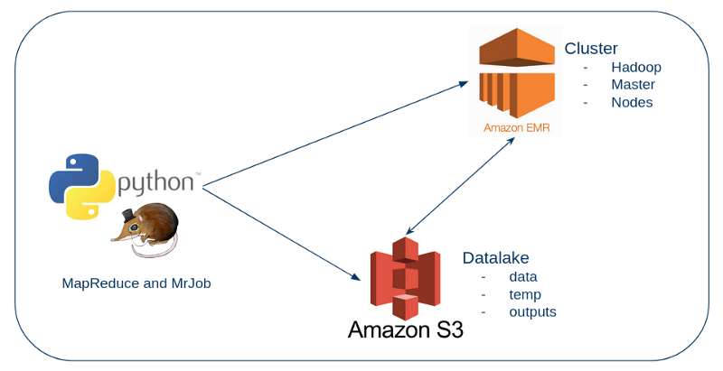

# Digital Innovation One

Código criado para utilização junto a plataforma da Digital Innovation One

## Criando seu Ecossistema de Big Data na Nuvem
### MapReduce com Amaon EMR e MRJob
Execução de Job MapReduce com Python MRJob e Amazon EMR para análise de dados textuais não estruturados

Documentação do MrJob: https://mrjob.readthedocs.io/en/latest/

Artigo que serviu de base para o projeto: https://bit.ly/3dqcP0h

### Arquitetura do Projeto

### Serviços AWS utilizados
- Amazon EMR
- Amazon S3

### Bibliotecas Python utilizadas
- MRJob
- AWS Boto3
